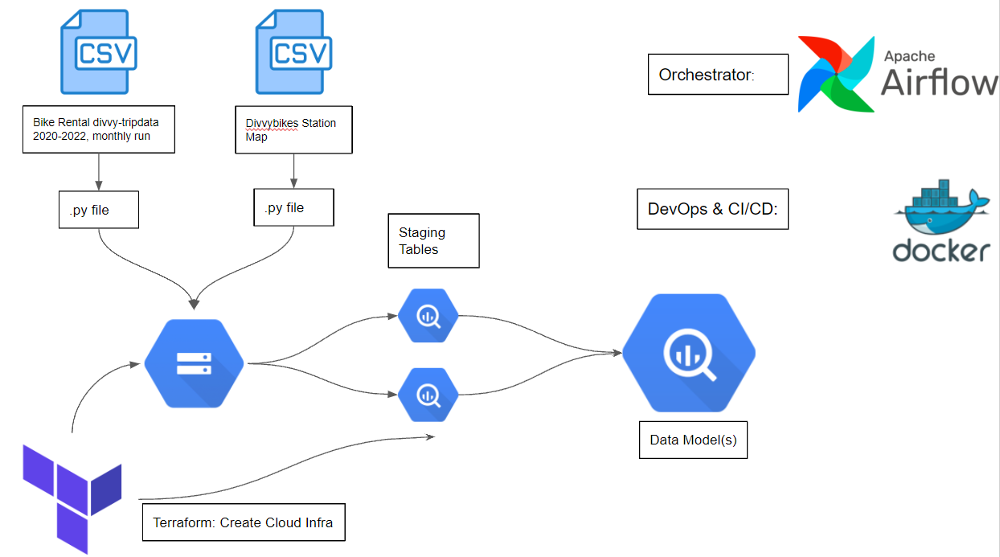

# Divvybikes 

## Project Objective
The objectives of this project are:

    1. Build an ELT pipeline for Divvybikes data using Apache Airflow and Google Bigquery
    2. Practice data modeling based on assumed access patterns for the data
    3. Learn data engineering!

# Architecture
## Project architecture:

Since I wanted to learn a lot about tools that data engineers use, I went with a workflow orchestrator, infrastructure as code and containerization. I chose airflow because there were a wealth of tutorials on how to use it and it seemed simple for scheduling monthly operations, and establishing dependencies proved necessary for my ELT pipeline. 

I chose Terraform for infrastructure as code since IAC seemed easier to use and manage than all of the different cloud provider UIs, which can be  a bit clunky and easy to lose track of. 

Docker seems like a necessity for data engineers regardless of what you are doing so that others can test your code, so I deployed airflow in docker to run my ELT pipeline. 

## Dataset:
### Divvybikes
 Divvybikes is Lyft's bike sharing service in Chicago, and has monthly uploads of ride data to their publicly available S3 bucket. This data is stored in .csv format. They do not keep a map of all of their stations, so I found that using a chicago government website and used it to add depth to my project in order to rank stations in order of popularity.

